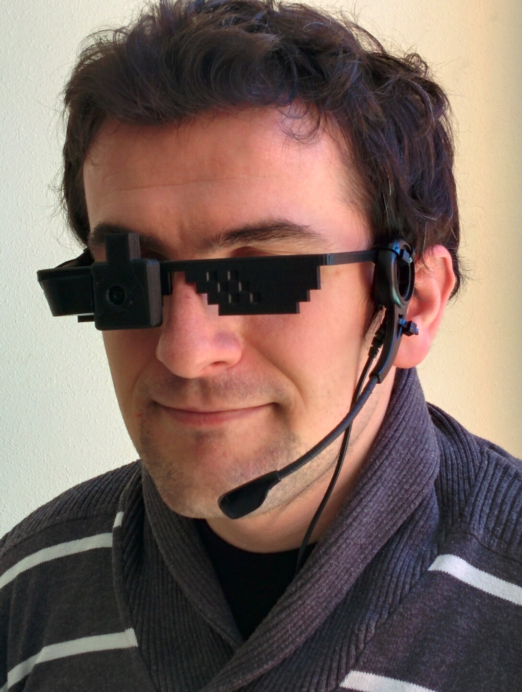

# MyEyes

Cierra los ojos. Imagina tenerlos cerrados una hora, un día, un año... hay cerca de 40 millones de personas ciegas en el mundo, y alrededor de 300 millones con algún tipo de discapacidad visual. My Eyes les permite volver a abrir los ojos. 

El proyecto consiste en unas **gafas impresas en 3D con una cámara HD integrada**. La cámara está conectada a una Raspberry Pi, que el invidente lleva en la cintura. Se puede interactuar con las gafas mediante **comandos de voz**, para recibir distintos tipos de ayuda:

- Identificar y describir qué **personas** tienes delante (Ejemplo: "tienes delante a 2 personas de unos 25 años que tienen barba")
- Identificar **productos y marcas** (Ejemplo: "tienes en la mano un producto de la marca Coca Cola")
- Leer **textos** escritos.

Además, permite reportar incidencias en la vía, para generar una base de datos abierta que ayude tanto a las administraciones, como a otras personas con dificultades, a encontrar mejores rutas.

El proyecto se ha realizado teniendo en mente que las gafas deben ser baratas. El coste completo de las gafas, la cámara HD, una Raspberry Pi y los conectores es inferior a los 50 euros. Tanto el software como los modelos 3D de todos los componentes están disponibles públicamente para que cualquiera pueda reproducirlas con facilidad.

## Equipo

* **Juan**: Ingeniero de teleco, maestro del soldador y especialista en electrónica.
* **Cristian**: Ingeniero en informática y experto en desarrollo web y dispositivos móviles.
* **Guido**: Licenciado en investigación de mercados e ingeniero de telecomunicación, experto en cloud computing y desarrollo backend ([@palmerabollo](http://twitter.com/palmerabollo)).

## Arquitectura

* **Gafas**: impresas en 3D durante el Hackaton, llevan integrada una pequeña cámara HD y un micrófono. Su peso total es de unos 50 gramos. Los modelos 3D se encuentran disponibles en el repositorio [unblind-3d-models](https://github.com/unblind/unblind-3d-models).

* **Controlador**: basado en una Raspberry Pi, es el cerebro encargado de interpretar las órdenes dadas por la persona que lleva las gafas, utilizar diferentes servicios online y responder con una respuesta adecuada al usuario. Toda la electrónica se encuentra disponible en el repositorio [unblind-electronics](https://github.com/unblind/unblind-electronics) y el código desarrollado en [unblind](https://github.com/unblind/unblind).

* **Web de gestión**: desarrollada con HTML/CSS/Javascript para gestionar las gafas del usuario de forma remota, conocer su posición, ver las fotos tomadas, enviar mensajes o ver el mapa de incidencias. El código se encuentra disponible en [myeyes-ui](https://github.com/unblind/myeyes-ui).

## Tecnologías utilizadas

La solución está desarrollada utilizando algunas piezas de software libre.

* [Jasper](http://jasperproject.github.io/), un servicio para interpretar comandos de voz del usuario. Lo hemos modificado y ampliado para recibir nuevos comandos de voz (tomar foto, reportar incidencia). Los nuevos módulos se encuentran en el repositorio [jasper-unblind-modules](https://github.com/unblind/jasper-unblind-modules).
* [Festival](http://festvox.org/festival/), para la conversión de texto a voz, con ayuda de la librería [say.js](https://github.com/marak/say.js/).
* [Raspbian Jessie](https://www.raspberrypi.org/downloads/raspbian/), el sistema operativo para la Raspberry Pi
* jQuery y Bootstrap para el desarrollo de la aplicación web.

Además hemos utilizado servicios online como:

* [wit.ai](http://wit.ai/), para la conversión de voz a texto y cálculo de la intención del usuario
* [Microsoft Oxford](https://www.projectoxford.ai/) para reconocimiento y análisis de caras
* [Google Cloud Vision API](https://cloud.google.com/vision/) para identificar escenas, marcas, etc.
* [Firebase](https://www.firebaseio.com/) como base de datos para almacenar información.

## Más información

* [Video promocional](https://vimeo.com/156887939) en vimeo (1 min)
* [Video corto idea + demo] en vimeo (https://vimeo.com/156949884) (2 min)
